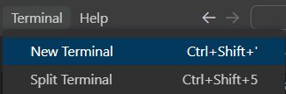
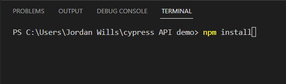
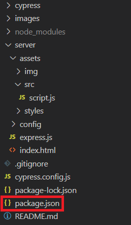
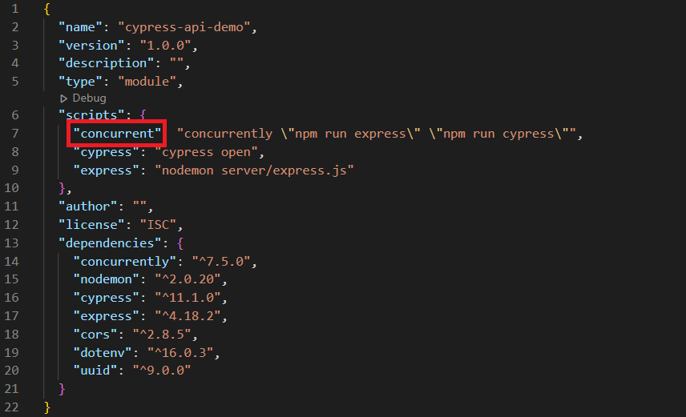
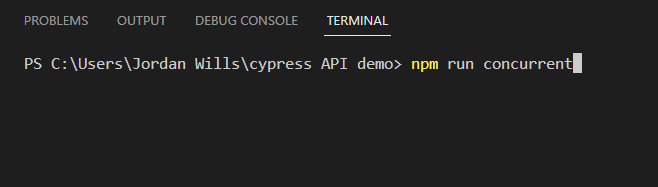
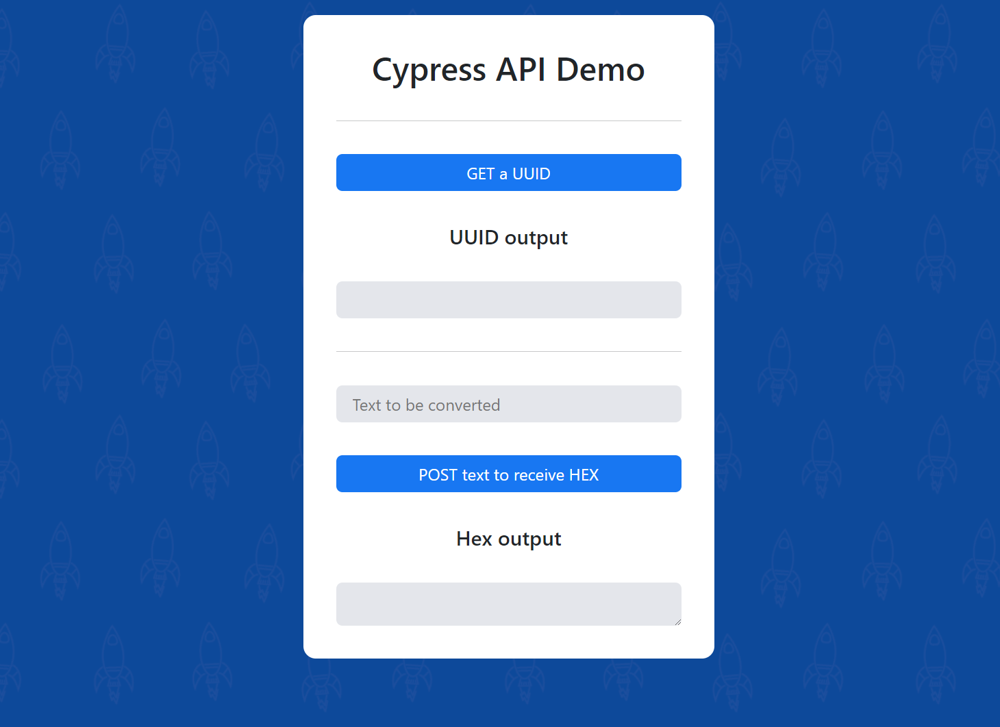
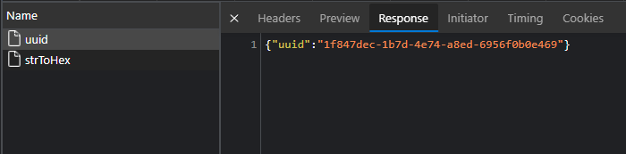
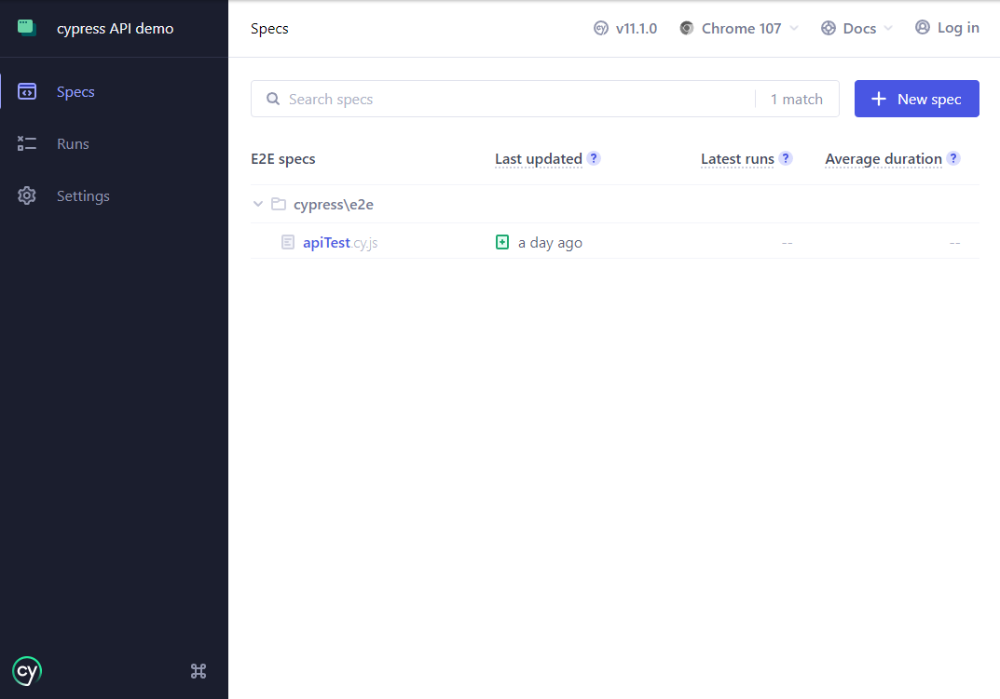
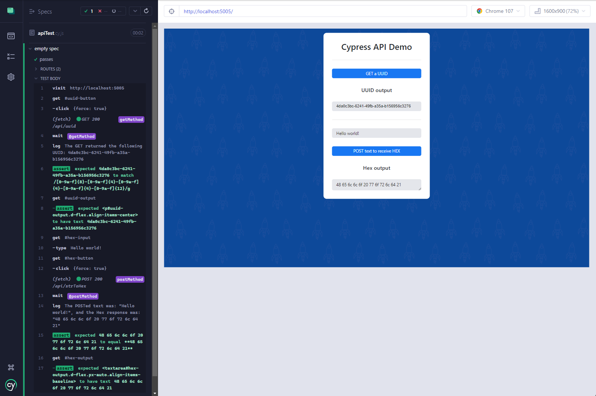
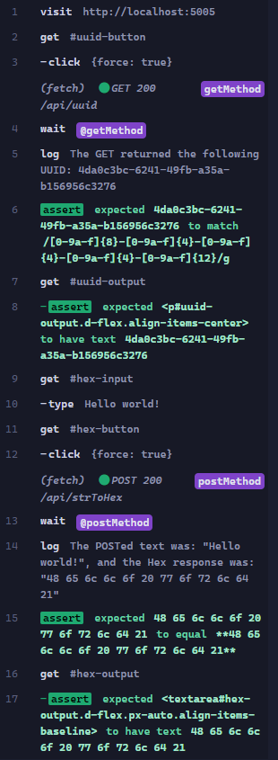

## Cypress API demo

 

A simple demonstration of Cypress' capability to intercept and assert the contents of an API request

 

#

 

### Prerequisite applications

- [ ] [Git](https://git-scm.com/downloads)
- [ ] [Node.js](https://nodejs.org/en/download/)
- [ ] [VSCode]()

#

 

### Getting started

1. Open a terminal, by navigating to "Terminal > New Terminal" along the top navigation bar.
   
   
2. Once open, type the following command: "npm install", and press enter.
   
   
3. Open the *package.json* file in your folder hierarchy.
   
   
4. Identify the name of a *script* you want to run, in this case we will use "concurrent"
   
   
5. In your terminal, type the following command: "npm run concurrent", and press enter.
   
   

#

 

### Navigating the Express website

Once the script has started running, Express should start running an HTML server on [localhost:5005](localhost:5005)/[127.0.0.1:5005](127.0.0.1:5005), which you can navigate to and explore. It should look something like this:

 
   
   

On the website is a button to generate a [UUID](https://en.wikipedia.org/wiki/Universally_unique_identifier), where it is then outputted below the button , and an input box and button to convert ASCII text into its Hex value counterpart, where it is then outputted below the button.

 

By opening the developer tools, and navigating to the Network tab, we can see that when we press either button, a request is sent to the Express server, and each responds with some information supplied by the server:

 

   

For each of these requests, there are two content parts: There is a request portion, and a response portion. As well as these, we also have have meta information about the request, that includes header information that tells the server how to handle the network request. The server is also able to apply its own headers to a request, usually for security related reasons.

 

In both example requests, the information request and/or response are both formatted as *json* information.

#

 

### Navigating the Cypress test

Upon running the "npm run concurrent" script, Cypress should have also initialised and opened up. Once open, there will be two options for testing type, and in this case we are using the "E2E Testing" suite, which is already configured. Clicking it will then open a page asking you to select a browser, I personally chose Chrome, however, other browsers *should* work too. After the testing type, and the browser, you should see a screen like this:

   

 

Finally, after all of this reading, simply click the "apiTests.cy.js" test specification, and you'll see Cypress in action. You'll know it's working if it comes up with a page like this:

   

 

You'll notice, on the left-hand side of the test runner, is the test body. This area lists the commands and assertions within our test spec. For our current test, this is what that list looks like:

   

And here is the list of what each of those steps are (descending order) - 

1. Navigate to the locally hosted Express website
2. Getting the "GET a UUID" button
3. Once gotten, clicking the aforementioned button (using force)
    
   **Intercepting the "GET /api/uuid" request**
4. Waiting for the "GET /api/uuid" request to be completed
5. Logging the response of the "GET /api/uuid" request
6. Asserting that the response of the "GET /api/uuid" request matches the *regex* formatting for a UUID
7. Getting the UUID output container
8. Asserting the contents of the container match the response from the "GET /api/uuid" request
9. Getting the input box used to convert ASCII text to Hex
10. Typing into the input "Hello world!"
11. Getting the "POST text to receive HEX" button
12. Once gotten, clicking the aforementioned button (using force)
    
   **Intercepting the "POST /api/strToHex" request**
13. Waiting for the "POST /api/strToHex" request to be completed
14. Logging the response of the "POST /api/strToHex" request
15. Asserting that the response of the "POST /api/strToHex" matches a locally generated (within the HTML) ASCII to Hex output
16. Getting the Hex output container
17. Asserting the contents of the container match the response from the "POST /api/strToHex" request

#

 

### Contact

If there are further questions relating to this demonstration, please contact: [jordanewills@gmail.com](jordanewills@gmail.com);